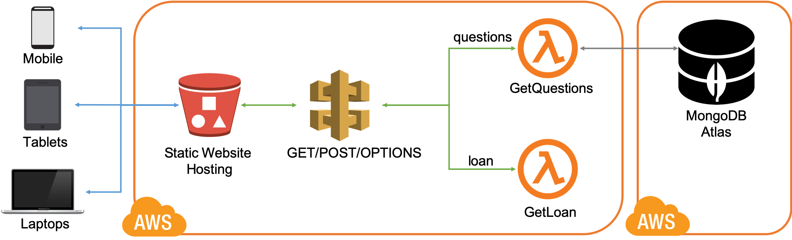

# dwpHackTheNorthUi
This application is a prep work for the 2019 Hack The North Event

## Objectives
* Help vulnerable people to understand and manage their finances.
* Help vulnerable people to manage different income sources (i.e., benefits payments, local authorities, and charities). 
* Help vulnerable people to save money.
* Help vulnerable people to predict their finances based on life time event (i.e., divorce, losing a job, family loss).

## Technologies
- Frontend: React/TypeScript, Progressive Web Application (PWA), GOV.UK Design System (GDS) styling
- Backend: Go
- Database: MongoDB Atlas
- Deployment: AWS Cloud Development Kit (CDK) in TypeScript
- Hosting: AWS services (i.e., S3, Lambda, API Gateway, IAM, and CloudFormation)

## Architecture
The architecture of the application is straightforward and it consists of the components as shown in the diagram below. 

An S3 bucket is configured to host the static resources for our web application. 
Thus, all of the static web content including HTML, CSS, JavaScript, images and other files are stored in S3.
End users can then use our application using the public website URL exposed by S3. 
This eliminates the need to run any web servers or configure other services to make our application available to the public. 

For data storage, an instance of `MongoDB Atlas` is deployed in an AWS environment provided by MongoDB. 
A public connection is enabled to this database instance.

Since the application is implemented as PWA, end users can access the service using any portable device such as mobile phones, tablets, laptops and PCs. 
End users start by taking a survey where the list of questions for the survey are fetched from the `questions` endpoint provided by the REST API (i.e., `API Gateway`).   
The REST API triggers the `GetQuestions` function. 
This function establishes a connection to the database, retrieves all the questions from a collection, and returns the list of questions in JSON format.
Once the survey is complete, the survey answers are sent to the `GetLoan` function through the `loan` endpoint. 
The result of the survey is then shown to the end user.

## Future Work
The following are the future work required to harden the security of the application and infrastructure, and enable disaster recovery.
* Create VPC for the deployment infrastructure.
* Create a VPC peering between the deployment infrastructure and `MongoDB Atlas` environment.
* Create a disaster recovery strategy for all the components in the infrastructure.

## Contributors
Here is the list of contributors in an alphabetical order:
* __Adam Cole__
* __Andy Stone__
* __Asyl Jumagaliyev__
* __Ioana Grigoriu__
* __Kevin Murray__
* __Michael Chadwick__
* __Mike Dickens__

